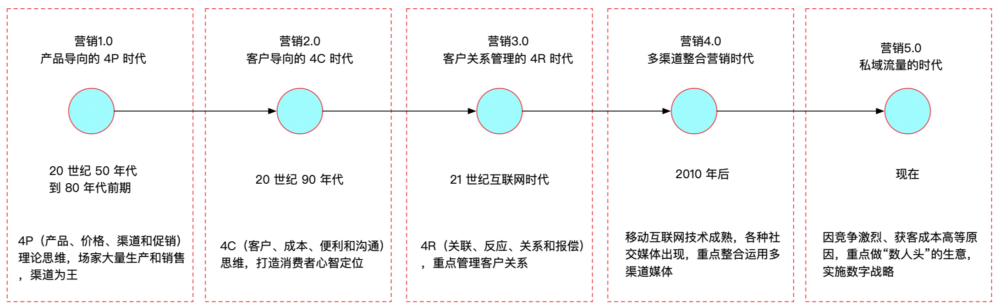

[TOC]

### 前言

怀着对“营销”继续探索的心情，今年3月份完成了《营销5.0》的阅读，读本书的初衷是希望从书中能学习到关于营销更专业、更细粒度的知识，比如怎么设计一个完善的会员积分系统，积分监控怎么做，积分价值怎么设定等等，然而事与愿违，**营销5.0主要围绕着 CIDR 模型来一点点阐述后互联网时代的企业战略营销框架**。对于贴地气的互联网营销技术开发人员，命题有点大但读起来不费劲。本书适用于从事营销产品相关的运营、销售和开发人员，读完此书你将会收获：
-  了解营销的发展路径和每个阶段的思维模式
-  了解 CIDR 模型是什么，了解后互联网时代企业战略营销的方向
-  了解会员体系的设计思路，了解移动营销和社交媒体营销应用 CIDR 模型的具体细节

下面结合自己的理解做一下对《营销5.0》的总结。

### 营销 1.0 到营销 5.0 的发展路径

随着国内电商的流量见顶，国内电商公司遇到了新的挑战（如流量被头部互联网公司占据、获取成本越来越高等），这种情况下怎么做营销思维的转变是非常重要的，《营销5.0》在接下来的章节中会提出 CIDR 框架，并通过这一框架推导出后互联网时代实施战略营销的四个核心能力：

- 会员大数据营销
- 移动营销
- 社交媒体营销
- 交易平台整合

### CIDR 模型

《营销5.0》提出了一套客户全生命周期的深度整合营销框架，称为 CIDR 模型，CIDR 是接触（Contact）、辨识（Identify）、数据（Data）和反应（React）四个词的缩写，这四个词描述了客户经营的几个主要阶段，如下图所示：

通过这一框架可以推导出后互联网时代实施战略营销的四个核心能力（即本书的全部内容）：

- **会员大数据营销**

在 CIDR 模型的数据（Data）阶段，可设计一套完善的会员制度和接触计划达到用户留存和不断获客的目的，另外同时在 CIDR 的反应（React）阶段可根据客户不同实施不同场景不同目的的接触，这是文中讲述的第二部分。

- **移动营销**

在 CIDR 模型的接触（Contact）与辨识（Identify）阶段可利用移动技术来触发用户，触发的场景包括：场景、位置、时间、天气、轨迹和社会触发，这是文中讲述的第三部分。

- **社交媒体营销**

社交媒体营销以一个中心（以客户为中心）、四个要项（社群、场景、内容和运营）来作为战略思考模型，以此来应用 CIDR 模型。这是文中讲述的第四部分。

- **交易平台整合**

从营销到交易平台的整合。这是文中讲述的第四部分。

### 小结

​          《营销5.0》主要围绕着 CIDR 模型来一点点展开的，从营销的发展历程说起，到会员大数据营销、移动营销和社交媒体营销，再到交易平台整合，这些都是 CIDR 模型在不同场景下的应用，本书所述营销方法和策论比较与时俱进，对于营销从业人员有一定的指导意义，值得一读。

附《营销 5.0读书笔记》xmind各章详细总结文档，参考 github：

成长也是一种美好。

